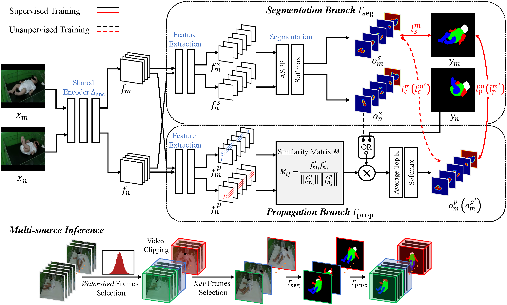
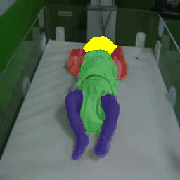
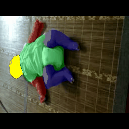
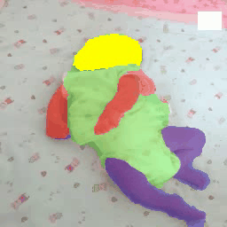

SiamParseNet
====

The code implementation of our MICCAI20 paper [SiamParseNet: Joint Body Parsing and Label Propagation in Infant Movement Videos
](https://arxiv.org/abs/2007.08646). 

<div align=center></div>

Example Results
----
<div align=center>



</div>

Dependencies
----
Python 3.7.10, Pytorch 1.10.2, etc.

Quick Start
----
Here we use a simple example to show how to train our model in full-supervised way.
```python
# A toy example to show how to train SiamParseNet in a fully-supervised way
import os
import torch
from SPN.SPNet import SPNet, resnet_feature_layers
from ProUtils.misc import vl2ch, get_1x_lr_params, get_10x_lr_params, loss_calc, dist_loss_calc
import torch.optim as optim

# setting GPU
os.environ["CUDA_VISIBLE_DEVICES"] = "0"

# using fully-supervised SPN for training
model = SPNet()
model = model.cuda()

# finetuning from pretrained DeepLab is important for the training of SPN
# set use_finetune True once you set the path
# setting the path to pretrained DeepLab model
# which can be downloaded from
# https://drive.google.com/file/d/0BxhUwxvLPO7TVFJQU1dwbXhHdEk/view?resourcekey=0-7UxnHrm5eDCyvz2G35aKgA
use_finetune = False
if use_finetune:
    pretrained_deeplab_path = ""
    # load pretrained PropNet Model
    saved_matnet_state_dict = torch.load(pretrained_deeplab_path)
    for name, _ in model.CommonFeatureExtract.state_dict().items():
        if "num_batches_tracked" in name.split('.'):
            continue
        ckpt_name = name.replace("model." + name.split('.')[1], "Scale." + resnet_feature_layers[int(name.split('.')[1])])
        model.CommonFeatureExtract.state_dict()[name].copy_(saved_matnet_state_dict[ckpt_name])
    for name, _ in model.MatFeatureExtract.state_dict().items():
        if "num_batches_tracked" in name.split('.'):
            continue
        ckpt_name = name.replace("model.", "Scale.layer4.")
        model.MatFeatureExtract.state_dict()[name].copy_(saved_matnet_state_dict[ckpt_name])

    # load pretrained SegNet Model
    saved_segnet_state_dict = torch.load(pretrained_deeplab_path)
    for name, _ in model.SegFeatureExtract.state_dict().items():
        if "num_batches_tracked" in name.split('.'):
            continue
        ckpt_name = name.replace("model", "Scale.layer4")
        model.SegFeatureExtract.state_dict()[name].copy_(saved_segnet_state_dict[ckpt_name])

# freeze BN layers
for name, param in model.named_parameters():
    if name.find('bn') != -1:
        param.requires_grad = False
model.eval()  # evaluation mode for BN layers

# setting learning rate
learning_rate = 2.5e-4
momentum = 0.9
weight_decay = 0.0005
optimizer = optim.SGD([{'params': get_1x_lr_params(model), 'lr': learning_rate},
                       {'params': get_10x_lr_params(model), 'lr': 10 * learning_rate}],
                      lr=learning_rate,
                      momentum=momentum,
                      weight_decay=weight_decay)
optimizer.zero_grad()

# setting x_m (src_img_batch) and x_n (tar_img_batch)
# size is (batch, channel, height, width)
src_img_batch = torch.rand((2, 3, 256, 256)).cuda()
tar_img_batch = torch.rand((2, 3, 256, 256)).cuda()

# setting y_m (src_lbl_batch) and y_n (tar_lbl_batch)
# size is (batch, height, width)
src_lbl_batch = torch.randint(high=5, size=(2, 256, 256)).cuda().to(dtype=torch.float32)
tar_lbl_batch = torch.randint(high=5, size=(2, 256, 256)).cuda().to(dtype=torch.float32)

# change to one-hot representation
# size is (batch, channel, height, width)
src_lbl_batch_resize = vl2ch(src_lbl_batch).cuda()
tar_lbl_batch_resize = vl2ch(tar_lbl_batch).cuda()

# One forward during training
# outputs are segmentation maps from segmentation branch (*_img_seg_lbl) and propagation branch (*_img_mat_lbl)
src_img_seg_lbl, tar_img_seg_lbl, src_img_mat_lbl, tar_img_mat_lbl = model(src_img_batch,
                                                                           tar_img_batch,
                                                                           src_lbl_batch_resize,
                                                                           tar_lbl_batch_resize)

# we suggest to use class weight, here we set None for simplicity
# segmentation branch loss
src_seg_loss = loss_calc(src_img_seg_lbl, src_lbl_batch_resize, class_weight=None)
tar_seg_loss = loss_calc(tar_img_seg_lbl, tar_lbl_batch_resize, class_weight=None)

# propagation branch loss
src_mat_loss = loss_calc(src_img_mat_lbl, src_lbl_batch_resize, class_weight=None)
tar_mat_loss = loss_calc(tar_img_mat_lbl, tar_lbl_batch_resize, class_weight=None)

# consistency loss between two branches
src_loss = dist_loss_calc(src_img_seg_lbl, src_img_mat_lbl, class_weight=None)
tar_loss = dist_loss_calc(tar_img_seg_lbl, tar_img_mat_lbl, class_weight=None)

loss = src_seg_loss + tar_seg_loss + src_mat_loss + tar_mat_loss + src_loss + tar_loss
loss.backward()
optimizer.step()
```

Our model can also be trained in a semi-supervised way. `tr_type` is set to 0, 1, 2 for unsupervised, semi-supervised, and fully-supervised cases, respectively.

```python
# A toy example to show how to train SiamParseNet in a semi-supervised way
import os
import torch
from SPN.SPNet import SemiSPNet, resnet_feature_layers
from ProUtils.misc import vl2ch, get_1x_lr_params, get_10x_lr_params, loss_calc, dist_loss_calc
import torch.optim as optim

# setting GPU
os.environ["CUDA_VISIBLE_DEVICES"] = "0"

# using fully-supervised SPN for training
model = SemiSPNet()
model = model.cuda()

# finetuning from pretrained DeepLab is important for the training of SPN
# set use_finetune True once you set the path
# setting the path to pretrained DeepLab model
# which can be downloaded from
# https://drive.google.com/file/d/0BxhUwxvLPO7TVFJQU1dwbXhHdEk/view?resourcekey=0-7UxnHrm5eDCyvz2G35aKgA
use_finetune = False
if use_finetune:
    pretrained_deeplab_path = ""
    # load pretrained PropNet Model
    saved_matnet_state_dict = torch.load(pretrained_deeplab_path)
    for name, _ in model.CommonFeatureExtract.state_dict().items():
        if "num_batches_tracked" in name.split('.'):
            continue
        ckpt_name = name.replace("model." + name.split('.')[1], "Scale." + resnet_feature_layers[int(name.split('.')[1])])
        model.CommonFeatureExtract.state_dict()[name].copy_(saved_matnet_state_dict[ckpt_name])
    for name, _ in model.MatFeatureExtract.state_dict().items():
        if "num_batches_tracked" in name.split('.'):
            continue
        ckpt_name = name.replace("model.", "Scale.layer4.")
        model.MatFeatureExtract.state_dict()[name].copy_(saved_matnet_state_dict[ckpt_name])

    # load pretrained SegNet Model
    saved_segnet_state_dict = torch.load(pretrained_deeplab_path)
    for name, _ in model.SegFeatureExtract.state_dict().items():
        if "num_batches_tracked" in name.split('.'):
            continue
        ckpt_name = name.replace("model", "Scale.layer4")
        model.SegFeatureExtract.state_dict()[name].copy_(saved_segnet_state_dict[ckpt_name])

# freeze BN layers
for name, param in model.named_parameters():
    if name.find('bn') != -1:
        param.requires_grad = False
model.eval()  # evaluation mode for BN layers

# setting learning rate
learning_rate = 2.5e-4
momentum = 0.9
weight_decay = 0.0005
optimizer = optim.SGD([{'params': get_1x_lr_params(model), 'lr': learning_rate},
                       {'params': get_10x_lr_params(model), 'lr': 10 * learning_rate}],
                      lr=learning_rate,
                      momentum=momentum,
                      weight_decay=weight_decay)
optimizer.zero_grad()

# setting x_m (src_img_batch) and x_n (tar_img_batch)
# size is (batch, channel, height, width)
src_img_batch = torch.rand((2, 3, 256, 256)).cuda()
tar_img_batch = torch.rand((2, 3, 256, 256)).cuda()

# setting y_m (src_lbl_batch) and y_n (tar_lbl_batch)
# size is (batch, height, width)
src_lbl_batch = torch.randint(high=5, size=(2, 256, 256)).cuda().to(dtype=torch.float32)
tar_lbl_batch = torch.randint(high=5, size=(2, 256, 256)).cuda().to(dtype=torch.float32)

# set training type
# 0: unsupervised, 1: semi-supervised, 2: supervised
# here we use 1: target image has label but source image doesn't have label
tr_type = 1
src_lbls = src_lbl_batch.cuda() if tr_type == 2 else None
tar_lbls = tar_lbl_batch.cuda() if tr_type != 0 else None

# change to one-hot representation
# size is (batch, channel, height, width)
src_lbl_batch_resize = vl2ch(src_lbl_batch).cuda() if tr_type == 2 else None
tar_lbl_batch_resize = vl2ch(tar_lbl_batch).cuda() if tr_type != 0 else None

# One forward during training
# outputs are segmentation maps from segmentation branch (*_img_seg_lbl) and propagation branch (*_img_mat_lbl)
src_img_seg_lbl, tar_img_seg_lbl, src_img_mat_lbl, tar_img_mat_lbl = model(src_img_batch,
                                                                           tar_img_batch,
                                                                           src_lbl_batch_resize,
                                                                           tar_lbl_batch_resize,
                                                                           tr_type)

# we suggest to use class weight, here we set None for simplicity
# segmentation branch loss
src_seg_loss = loss_calc(src_img_seg_lbl, src_lbl_batch_resize, class_weight=None) if tr_type == 2 else None
tar_seg_loss = loss_calc(tar_img_seg_lbl, tar_lbl_batch_resize, class_weight=None) if tr_type != 0 else None

# propagation branch loss
src_mat_loss = loss_calc(src_img_mat_lbl, src_lbl_batch_resize, class_weight=None) if tr_type == 2 else None
tar_mat_loss = loss_calc(tar_img_mat_lbl, tar_lbl_batch_resize, class_weight=None) if tr_type != 0 else None

# consistency loss between two branches
src_loss = dist_loss_calc(src_img_seg_lbl, src_img_mat_lbl, class_weight=None)
tar_loss = dist_loss_calc(tar_img_seg_lbl, tar_img_mat_lbl, class_weight=None)

if tr_type == 2:
    loss = (src_seg_loss + tar_seg_loss + src_mat_loss + tar_mat_loss + src_loss + tar_loss)
if tr_type == 1:
    loss = (tar_seg_loss + tar_mat_loss + src_loss + tar_loss)
if tr_type == 0:
    loss = (src_loss + tar_loss)

loss.backward()
optimizer.step()

```

DONE
----
The network structure of SiamParsetNet

TODO
----
The AAT training and MSI testing codes

Citing SiamParseNet
----
If you find our approaches useful in your research, please consider citing:
```
@inproceedings{ni2020siamparsenet,
  title={SiamParseNet: Joint Body Parsing and Label Propagation in Infant Movement Videos},
  author={Ni, Haomiao and Xue, Yuan and Zhang, Qian and Huang, Xiaolei},
  booktitle={International Conference on Medical Image Computing and Computer-Assisted Intervention},
  pages={396--405},
  year={2020},
  organization={Springer}
}
```
For any problems with the code, please feel free to open an issue or contact me: homerhm.ni@gmail.com

Acknowledgement
----
We acknowledge the code about DeepLab from [speedinghzl](https://github.com/speedinghzl/Pytorch-Deeplab).
